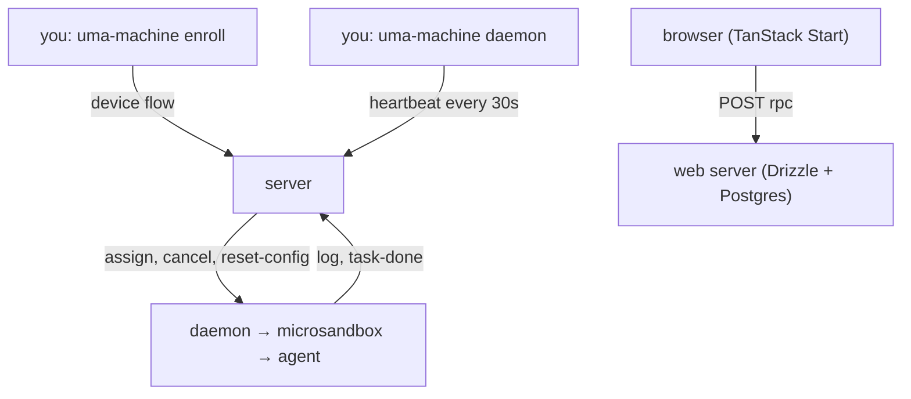

New here? This is the big picture. For the picture version, see [/visualize/architecture](/visualize/architecture).

## The journey of a task

1. **Enroll** (`apps/machine/src/enroll.ts`) — you approve a device code in the browser, and the machine saves its identity (`0600`), limits from `quotaDefaultsFromRam`, SQLite, and optionally a systemd unit. Start at [/cli/enroll](/cli/enroll).
2. **Stay in touch** (`apps/machine/src/daemon.ts`) — the daemon connects with backoff, sends a persist-first heartbeat every tick, and reaps old stopped sandboxes. See [/cli/daemon](/cli/daemon) and [/machine/heartbeat](/machine/heartbeat).
3. **Run work** (`apps/machine/src/execution.ts`) — on `assign`, the machine reserves a sandbox, atomically claims the task (`POST /api/machines/claim`, `409` means someone else won), starts the sandbox, binds git, streams redacted logs in 256 KB chunks, then reports `task-done` and stops. See [/machine/execution-pipeline](/machine/execution-pipeline).
4. **Stay converged** — the server can send `reset-config`, and the machine converges config then acks each key (plus `sync-ack` for `"*"`). See [/machine/reset-config](/machine/reset-config).
5. **Watch in the browser** (`apps/web`) — triage a Signal, create a Task (`queued`), watch it go `running → completed | failed` as `log` / `task-done` frames arrive over `/api/machines/ws`. Enroll devices at `/device`, manage machines at `/settings/machines`. Web procedures: [/contracts/server-web](/contracts/server-web).
6. **Stay compatible** — if the machine is too old, the server sends `UPGRADE_REQUIRED` and the daemon exits `3`. See [/contracts/versioning](/contracts/versioning).

## Where code lives

| Dir | What you'll find there |
| --- | --- |
| `apps/web` | Product app (routes in `src/routes/`, oRPC in `src/rpc/`, machine server in `src/lib/machines/` + `server/machines-ws.ts`, schemas in `src/schemas/db/`) |
| `apps/machine` | Device agent (`src/`); its server side lives in `apps/web` |
| `apps/orpc-contract` | Frozen `v1` wire (`src/`), imported by machine via relative path, never the reverse |
| `apps/infra` | Pulumi (OCI + Cloudflare + Docker); `dev` stack skips the VM |
| `apps/documentation` | This site (Astro + Fumadocs) |
| `apps/cli` | `uma-docs` MCP/docs CLI — a different tool from `uma-machine` |

Known wiring drift (infra moved out of `apps/web`): `apps/web/package.json` `infra:*` scripts, `check-env.ts` import, root `check:env`/`infra:prepare`, and `apps/infra/docker/app.ts` build context still point at old paths — please double-check them (see root `AGENTS.md`).
