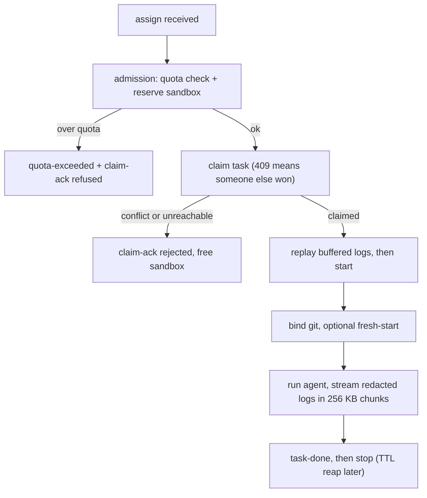

This is the heart of `uma-machine`: how a task goes from "please run this" to "done!". Implemented in `apps/machine/src/execution.ts:309` (`executeTask`) and shared by daemon `assign` handling and `uma-machine run`. Diagram: [/visualize/machine](/visualize/machine).

## The steps, in order

1. **Reserve first** — `snapshotQuota()` + `quotaPreCheck()` + `createSandbox()` run under an admission lock. Over quota? We emit `quota-exceeded { taskId, limits, usage }` **and** `claim-ack { ok: false, error: "QUOTA_EXCEEDED" }` (`quotaRefusalFrames` in `src/protocol.ts`), log `refused (quota)`, and stop without leaking a sandbox.
2. **Claim atomically** — `POST /api/machines/claim { machineId, sandboxId, taskId }`. A `409`/4xx means the server gave the task to someone else, so we send `claim-ack { ok: false, error: CLAIM_REJECTED }` and free the sandbox. Network failure after retries gives `CLAIM_UNREACHABLE`. Success sends `claim-ack { ok: true, sandboxId }`.
3. **Catch up, then start** — replay any buffered `log` frames, then `startSandbox`.
4. **Bind git** — `ensureBinding` clones, fetches, and checks out `branchForTask(taskId)` (like `task/<short>`). If `freshStart` was requested, we run `git clean -fdx + reset --hard` first.
5. **Run + stream safely** — `execStream` runs the agent binary with secrets redacted (`Redactor` seeded with session + GitHub tokens), splitting output into 256 KB or smaller UTF-8 chunks (`splitChunks`, byte-accurate for multibyte text) and emitting `log { taskId, chunk, stream?: stdout|stderr|system }` per chunk.
6. **Finish + rest** — emit `task-done { taskId, status: completed|failed, projectId, result? up to 64k }`, then `stopSandbox` (left `stopped` for later TTL reap — never removed inline).
7. **Handle bumps gracefully** — any throw frees the sandbox. `cancelTask(taskId)` checks the in-flight map first, then falls back to the `task.id` label lookup, and runs `stopSandbox --force`. Cancel checks before claim, after claim, and before `task-done` suppress the final frame when cancelled.

## Key modules

| Module | What it does for you |
| --- | --- |
| `src/sandbox.ts` + `src/sandbox/driver.ts` | `create/start/stop/remove/list/exec/execStream/metrics`, `snapshotQuota`; driver order `sdk` then `cli` then fail-closed |
| `src/sandbox/cli.ts:29` | The `msb create/start/stop/remove/list/exec` calls with `task.id` / `project.id` labels |
| `src/git-binding.ts` | `ensureBinding`, `freshStart`, `branchForTask` |
| `src/redact.ts` | `Redactor` + byte-accurate `splitChunks(LOG_FRAME_CAP_BYTES)` |
| `src/protocol.ts` | `assertMachineFrame`, `quotaRefusalFrames` |
| `src/limits.ts` | Figures out your `effectiveLimits` |
| `src/db.ts` | Receipts, heartbeat rows, sandbox events |

Sandbox image and sizing (`UBUNTU_IMAGE`, `TASK_CPUS=1`, `TASK_MEMORY_MB=1024`, caps) live in `apps/orpc-contract/src/constants.ts`.
