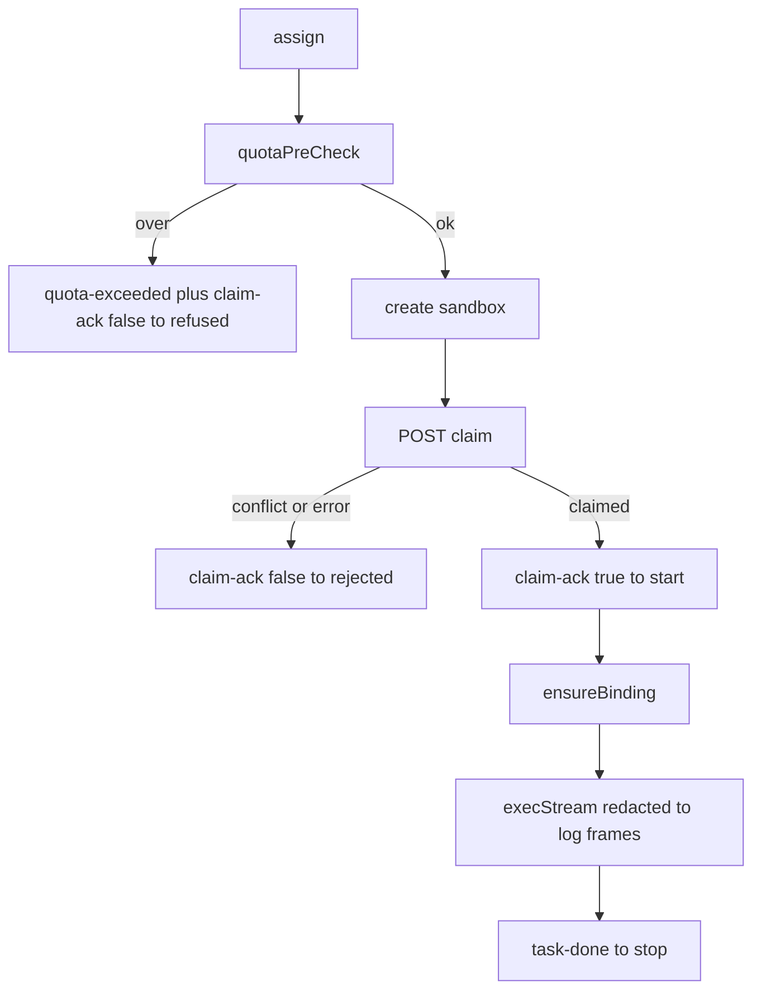

Implemented in `apps/machine/src/execution.ts:309` (`executeTask`), shared by daemon `assign` handling and `uma-machine run`. Diagram: [/visualize/machine](/visualize/machine).

## Key modules

| Module | Role |
| --- | --- |
| `src/sandbox.ts` + `src/sandbox/driver.ts` | `create/start/stop/remove/list/exec/execStream/metrics`, `snapshotQuota`; driver `sdk → cli → fail-closed` |
| `src/sandbox/cli.ts:29` | `msb create/start/stop/remove/list/exec` invocations with `task.id` / `project.id` labels |
| `src/git-binding.ts` | `ensureBinding`, `freshStart`, `branchForTask` |
| `src/redact.ts` | `Redactor` + byte-accurate `splitChunks(LOG_FRAME_CAP_BYTES)` |
| `src/protocol.ts` | `assertMachineFrame`, `quotaRefusalFrames` |
| `src/limits.ts` | `effectiveLimits` resolution |
| `src/db.ts` | receipts, heartbeat rows, sandbox events |

Sandbox image and sizing constants (`UBUNTU_IMAGE`, `TASK_CPUS=1`, `TASK_MEMORY_MB=1024`, caps) live in `apps/orpc-contract/src/constants.ts`.
